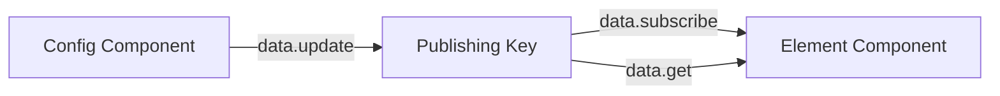

This example demonstrates creating a complete custom CMS element with preview, configuration, and rendering.

## Overview

We'll create a video player element for Dailymotion that includes:
- Element registration
- Preview component
- Configuration component
- Element rendering component

## Project Structure

```
src/
├── frontend/
│   ├── init/
│   │   └── init-app.ts
│   ├── cms/
│   │   └── ex-dailymotion/
│   │       ├── ex-dailymotion-constants.ts
│   │       ├── ex-dailymotion-preview.vue
│   │       ├── ex-dailymotion-config.vue
│   │       └── ex-dailymotion-element.vue
│   └── locations/
│       └── init-locations.ts
```

## Complete Implementation

### Step 1: Define Constants

```typescript title="cms/ex-dailymotion/ex-dailymotion-constants.ts"
const CMS_DAILYMOTION_ELEMENT_NAME = 'ex-dailymotion';

export default {
    CMS_DAILYMOTION_ELEMENT_NAME,
    PUBLISHING_KEY: `${CMS_DAILYMOTION_ELEMENT_NAME}__config-element`,
};
```

### Step 2: Register the CMS Element

```typescript title="init/init-app.ts"
import { cms } from '@shopware-ag/meteor-admin-sdk';
import EX_DAILYMOTION_CONSTANTS from '../cms/ex-dailymotion/ex-dailymotion-constants';

// Register CMS element
void cms.registerCmsElement({
    name: EX_DAILYMOTION_CONSTANTS.CMS_DAILYMOTION_ELEMENT_NAME,
    label: 'Dailymotion video',
    defaultConfig: {
        dailyUrl: {
            source: 'static',
            value: '',
        },
    },
});

// This creates three location IDs:
// - ex-dailymotion-element
// - ex-dailymotion-preview
// - ex-dailymotion-config
```

### Step 3: Create Preview Component

```vue title="cms/ex-dailymotion/ex-dailymotion-preview.vue"
<template>
    <div class="dailymotion-preview">
        <div class="preview-icon">
            <svg 
                width="64" 
                height="64" 
                viewBox="0 0 24 24" 
                fill="none" 
                xmlns="http://www.w3.org/2000/svg"
            >
                <path 
                    d="M8 5v14l11-7z" 
                    fill="#0066DC"
                />
            </svg>
        </div>
        <p class="preview-label">Dailymotion Video</p>
        <p class="preview-description">
            Add a Dailymotion video to your page
        </p>
    </div>
</template>

<style scoped>
.dailymotion-preview {
    display: flex;
    flex-direction: column;
    align-items: center;
    justify-content: center;
    padding: 24px;
    background: #f7fafc;
    border: 2px dashed #cbd5e0;
    border-radius: 8px;
    min-height: 150px;
}

.preview-icon {
    margin-bottom: 12px;
}

.preview-label {
    font-weight: 600;
    color: #2d3748;
    margin-bottom: 4px;
}

.preview-description {
    font-size: 12px;
    color: #718096;
    text-align: center;
}
</style>
```

### Step 4: Create Configuration Component

```vue title="cms/ex-dailymotion/ex-dailymotion-config.vue"
<template>
    <div class="dailymotion-config">
        <div class="config-header">
            <h3>Dailymotion Video Configuration</h3>
            <p>Configure your Dailymotion video element</p>
        </div>

        <div class="config-form">
            <sw-text-field
                label="Dailymotion Video URL"
                placeholder="https://www.dailymotion.com/video/..."
                v-model="elementConfig.dailyUrl.value"
                @input="onChange"
                helpText="Enter the full Dailymotion video URL"
            />

            <div v-if="videoId" class="preview-section">
                <h4>Preview</h4>
                <div class="video-preview">
                    <iframe
                        :src="embedUrl"
                        width="100%"
                        height="200"
                        frameborder="0"
                        allowfullscreen
                    />
                </div>
            </div>

            <div v-else class="no-preview">
                <p>Enter a valid Dailymotion URL to see preview</p>
            </div>
        </div>
    </div>
</template>

<script>
import { defineComponent } from 'vue';
import { data } from '@shopware-ag/meteor-admin-sdk';
import { SwTextField } from '@shopware-ag/meteor-component-library';
import EX_DAILYMOTION_CONSTANTS from './ex-dailymotion-constants';

export default defineComponent({
    components: {
        'sw-text-field': SwTextField,
    },
    data() {
        return {
            elementConfig: {
                dailyUrl: {
                    source: 'static',
                    value: '',
                },
            },
        };
    },
    computed: {
        videoId() {
            const url = this.elementConfig.dailyUrl.value;
            if (!url) return null;

            // Extract video ID from Dailymotion URL
            const match = url.match(/dailymotion\.com\/video\/([a-zA-Z0-9]+)/);
            return match ? match[1] : null;
        },
        embedUrl() {
            return this.videoId 
                ? `https://www.dailymotion.com/embed/video/${this.videoId}`
                : '';
        },
    },
    methods: {
        onChange() {
            // Publish config changes to element
            data.update({
                id: EX_DAILYMOTION_CONSTANTS.PUBLISHING_KEY,
                data: {
                    config: this.elementConfig,
                },
            });
        },
        async loadConfig() {
            try {
                const result = await data.get({
                    id: EX_DAILYMOTION_CONSTANTS.PUBLISHING_KEY,
                });

                if (result?.config) {
                    this.elementConfig = result.config;
                }
            } catch (error) {
                console.error('Failed to load config:', error);
            }
        },
    },
    mounted() {
        this.loadConfig();

        // Subscribe to external config changes
        data.subscribe(
            EX_DAILYMOTION_CONSTANTS.PUBLISHING_KEY,
            (response) => {
                if (response.data?.config) {
                    this.elementConfig = response.data.config;
                }
            }
        );
    },
});
</script>

<style scoped>
.dailymotion-config {
    padding: 20px;
}

.config-header {
    margin-bottom: 24px;
    padding-bottom: 16px;
    border-bottom: 1px solid #e2e8f0;
}

.config-header h3 {
    margin-bottom: 4px;
    color: #2d3748;
}

.config-header p {
    color: #718096;
    font-size: 14px;
}

.config-form {
    display: flex;
    flex-direction: column;
    gap: 20px;
}

.preview-section {
    padding: 16px;
    background: #f7fafc;
    border-radius: 8px;
}

.preview-section h4 {
    margin-bottom: 12px;
    color: #2d3748;
}

.video-preview {
    position: relative;
    padding-bottom: 56.25%; /* 16:9 aspect ratio */
    height: 0;
    overflow: hidden;
    border-radius: 4px;
}

.video-preview iframe {
    position: absolute;
    top: 0;
    left: 0;
    width: 100%;
    height: 100%;
}

.no-preview {
    padding: 40px;
    text-align: center;
    background: #edf2f7;
    border-radius: 8px;
    color: #718096;
}
</style>
```

### Step 5: Create Element Component

```vue title="cms/ex-dailymotion/ex-dailymotion-element.vue"
<template>
    <div class="dailymotion-element">
        <div v-if="videoId" class="video-container">
            <iframe
                :src="embedUrl"
                width="100%"
                height="100%"
                frameborder="0"
                allowfullscreen
                allow="autoplay; fullscreen; picture-in-picture"
            />
        </div>
        <div v-else class="no-video">
            <div class="placeholder-icon">
                <svg 
                    width="48" 
                    height="48" 
                    viewBox="0 0 24 24" 
                    fill="none"
                >
                    <path 
                        d="M8 5v14l11-7z" 
                        fill="#cbd5e0"
                    />
                </svg>
            </div>
            <p>No video configured</p>
            <p class="hint">Configure this element to add a Dailymotion video</p>
        </div>
    </div>
</template>

<script>
import { defineComponent } from 'vue';
import { data } from '@shopware-ag/meteor-admin-sdk';
import EX_DAILYMOTION_CONSTANTS from './ex-dailymotion-constants';

export default defineComponent({
    data() {
        return {
            videoUrl: '',
        };
    },
    computed: {
        videoId() {
            if (!this.videoUrl) return null;

            // Extract video ID from Dailymotion URL
            const match = this.videoUrl.match(/dailymotion\.com\/video\/([a-zA-Z0-9]+)/);
            return match ? match[1] : null;
        },
        embedUrl() {
            return this.videoId
                ? `https://www.dailymotion.com/embed/video/${this.videoId}?autoplay=0`
                : '';
        },
    },
    methods: {
        async loadConfig() {
            try {
                const result = await data.get({
                    id: EX_DAILYMOTION_CONSTANTS.PUBLISHING_KEY,
                });

                if (result?.config?.dailyUrl?.value) {
                    this.videoUrl = result.config.dailyUrl.value;
                }
            } catch (error) {
                console.error('Failed to load element config:', error);
            }
        },
    },
    mounted() {
        this.loadConfig();

        // Subscribe to config changes for live preview
        data.subscribe(
            EX_DAILYMOTION_CONSTANTS.PUBLISHING_KEY,
            (response) => {
                if (response.data?.config?.dailyUrl?.value) {
                    this.videoUrl = response.data.config.dailyUrl.value;
                }
            }
        );
    },
});
</script>

<style scoped>
.dailymotion-element {
    width: 100%;
}

.video-container {
    position: relative;
    padding-bottom: 56.25%; /* 16:9 aspect ratio */
    height: 0;
    overflow: hidden;
    background: #000;
    border-radius: 8px;
}

.video-container iframe {
    position: absolute;
    top: 0;
    left: 0;
    width: 100%;
    height: 100%;
}

.no-video {
    display: flex;
    flex-direction: column;
    align-items: center;
    justify-content: center;
    padding: 60px 20px;
    background: #f7fafc;
    border: 2px dashed #cbd5e0;
    border-radius: 8px;
    min-height: 200px;
}

.placeholder-icon {
    margin-bottom: 16px;
    opacity: 0.5;
}

.no-video p {
    color: #718096;
    margin-bottom: 4px;
}

.no-video .hint {
    font-size: 12px;
    color: #a0aec0;
}
</style>
```

### Step 6: Register Locations

```typescript title="locations/init-locations.ts"
import { createApp, h, defineAsyncComponent } from 'vue';
import { location } from '@shopware-ag/meteor-admin-sdk';
import '@shopware-ag/meteor-component-library/styles.css';

const locations = {
    'ex-dailymotion-config': defineAsyncComponent(
        () => import('../cms/ex-dailymotion/ex-dailymotion-config.vue')
    ),
    'ex-dailymotion-preview': defineAsyncComponent(
        () => import('../cms/ex-dailymotion/ex-dailymotion-preview.vue')
    ),
    'ex-dailymotion-element': defineAsyncComponent(
        () => import('../cms/ex-dailymotion/ex-dailymotion-element.vue')
    ),
};

const app = createApp({
    render: () => h(locations[location.get()])
});

app.mount('#app');
```

## Usage in CMS

<Steps>

### Open Shopping Experiences

1. Navigate to Content > Shopping Experiences
2. Create new or edit existing layout

### Add Element

1. In the element sidebar, find "Dailymotion video"
2. Drag and drop into your layout
3. You'll see the preview placeholder

### Configure Element

1. Click the element to open settings
2. Click the configuration button
3. Enter a Dailymotion URL:
   ```
   https://www.dailymotion.com/video/x8b2q3k
   ```
4. See live preview in the config modal
5. Save the configuration

### View Result

1. The element updates with the video embed
2. Save the Shopping Experience
3. View on the storefront

</Steps>

## Configuration Data Flow



1. **Config component** updates data via `data.update()`
2. **Publishing key** broadcasts changes
3. **Element component** receives updates via `data.subscribe()`

## Creating a CMS Block

You can also register a block that uses your element:

```typescript
import { cms } from '@shopware-ag/meteor-admin-sdk';

await cms.registerCmsBlock({
    name: 'ex-dailymotion-block',
    label: 'Dailymotion Video Block',
    category: 'video',
    slots: [
        {
            element: 'ex-dailymotion',
        }
    ],
    slotLayout: {
        grid: 'auto / auto'
    },
});
```

## Advanced: Two-Column Video Block

Create a block with two videos side by side:

```typescript
await cms.registerCmsBlock({
    name: 'ex-two-column-video',
    label: 'Two Column Videos',
    category: 'video',
    slots: [
        {
            element: 'ex-dailymotion',
        },
        {
            element: 'ex-dailymotion',
        }
    ],
    slotLayout: {
        grid: 'auto / 1fr 1fr'
    },
    previewImage: 'https://example.com/preview.png'
});
```

## Expected Output

### In CMS Editor

- Element appears in sidebar with preview
- Drag-and-drop functionality works
- Configuration modal opens on click
- Live preview updates as you type

### On Storefront

- Responsive video embed
- Full Dailymotion player functionality
- Proper aspect ratio maintained

## Best Practices

1. **Use vendor prefix**: Name elements uniquely (e.g., `my-company-video`)
2. **Provide defaults**: Always set default config values
3. **Live preview**: Subscribe to config changes in element component
4. **Error handling**: Handle missing or invalid URLs gracefully
5. **Responsive design**: Ensure elements work on all screen sizes
6. **Accessibility**: Add proper ARIA labels and keyboard support

## Common Issues

### Config Not Updating

Ensure publishing key matches:

```typescript
// Must be consistent across all components
const PUBLISHING_KEY = 'element-name__config-element';
```

### Element Not Showing

Verify location IDs are registered:

```typescript
// For element name: 'my-element'
// These must be registered:
'my-element-element'
'my-element-preview'
'my-element-config'
```

## Learn More

- [CMS Extensions Guide](/admin-sdk/guides/cms-extensions)
- [Data Management Guide](/admin-sdk/guides/data-management)
- [GitHub Example](https://github.com/shopware/meteor/tree/main/examples/admin-sdk-app)
